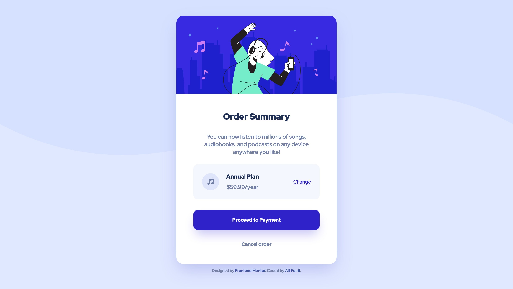

# Frontend Mentor - Order summary card solution

This is a solution to the [Order summary card challenge on Frontend Mentor](https://www.frontendmentor.io/challenges/order-summary-component-QlPmajDUj). Frontend Mentor challenges help you improve your coding skills by building realistic projects. 

## Table of contents

- [Overview](#overview)
  - [The challenge](#the-challenge)
  - [Screenshot](#screenshot)
  - [Links](#links)
- [My process](#my-process)
  - [Built with](#built-with)
  - [What I learned](#what-i-learned)
  - [Useful resources](#useful-resources)
- [Author](#author)
- [Acknowledgments](#acknowledgments)


## Overview

### The challenge

Users should be able to:

- See hover states for interactive elements

### Screenshot



### Links

- Solution URL: [GitHub](https://github.com/Alffonti/order-summary-component)
- Live Site URL: [Netlify](https://order-summary-component-by-alf.netlify.app/)

## My process

### Built with

- Semantic HTML5 markup
- CSS custom properties
- Flexbox
- CSS Grid
- Mobile-first workflow
- [React](https://reactjs.org/) - JS library

### What I learned

I used Chris Burnell's [clamp tool](https://chrisburnell.com/clamp-calculator/) to calculate viewport-based clamped values.


```scss
 &__content {
    padding: clamp(2.375rem, 2.155rem + 0.939vw, 3rem) clamp(1.5rem, 0.972rem + 2.254vw, 3rem);
  }
```

### Useful resources

- [Clamp calculator](https://chrisburnell.com/clamp-calculator/)
- [Managing Responsive Breakpoints](hhttps://www.sitepoint.com/managing-responsive-breakpoints-sass/)

## Author

- Website - [alffonti.netlify.app](https://alffonti.netlify.app/)
- Frontend Mentor - [@alffonti](https://www.frontendmentor.io/profile/Alffonti)
- Twitter - [@alphfonti](https://twitter.com/alphfonti)

## Acknowledgments

- [Chris Burnell](https://chrisburnell.com/)

- [Aituos](https://dev.to/aituos/frontend-mentor-order-summary-component-3ffi)
